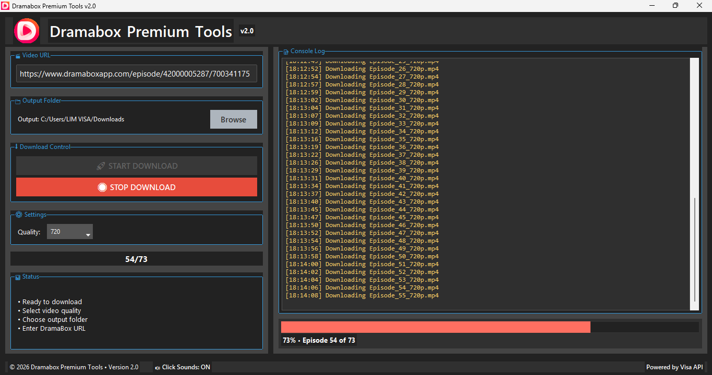

# DramaBox Premium Downloader v2.0

A powerful desktop application for downloading high-quality videos from DramaBox with a beautiful graphical interface.




## ✨ Features

- **🎬 Easy URL Input** - Simply paste any DramaBox episode URL
- **⚡ Fast Downloads** - Multi-threaded downloading for maximum speed
- **🎯 Quality Selection** - Choose from 1080p, 720p, or 540p resolution
- **📁 Custom Output Folder** - Save videos anywhere on your computer
- **🔊 Audio Feedback** - Click sounds for better user experience
- **📊 Real-time Progress** - Live progress bar and detailed console log
- **🎨 Modern UI** - Dark theme with responsive design
- **🚀 One-Click Download** - Download entire series with one click
- **🛑 Stop Control** - Stop downloads at any time

## 📦 Installation

### Option 1: Download Executable (Recommended for Windows Users)

1. **Download the latest release** from the [Releases](https://github.com/limvisa/Dramabox-Visa.API/releases) page
2. **Run the installer** or executable file
3. **No additional software required** - It's a standalone application

### Option 2: Run from Source Code

#### Prerequisites:
- Python 3.8 or higher
- pip (Python package manager)

#### Installation Steps:

1. **Clone the repository**:
   ```bash
   git clone https://github.com/limvisa/Dramabox-Visa.API.git
   cd Dramabox-Visa.API
